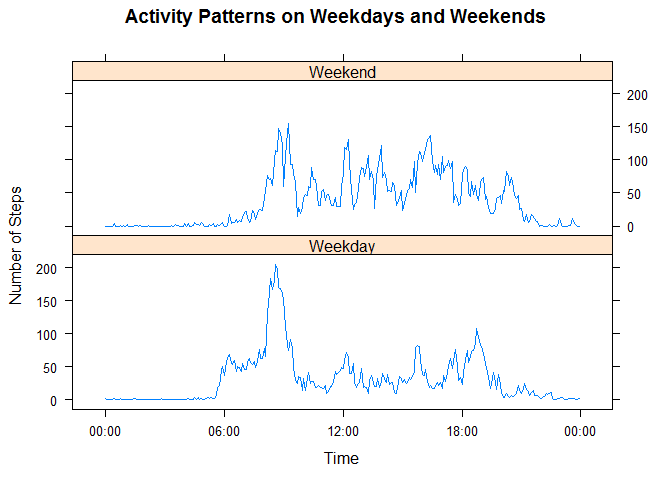

# Reproducible Research: Peer Assessment 1


## Loading and preprocessing the data

### 1. Load the data

```r
activity <- read.csv(unz("activity.zip", "activity.csv"), na.strings="NA")
```

### 2. Process/transform the data into a suitable format

```r
activity$date <- as.Date(as.character(activity$date), "%Y-%m-%d")
activity$interval <- as.factor(activity$interval)
str(activity)
```

```
## 'data.frame':	17568 obs. of  3 variables:
##  $ steps   : int  NA NA NA NA NA NA NA NA NA NA ...
##  $ date    : Date, format: "2012-10-01" "2012-10-01" ...
##  $ interval: Factor w/ 288 levels "0","5","10","15",..: 1 2 3 4 5 6 7 8 9 10 ...
```


## What is the mean total number of steps taken per day?
### 1. Calculate the total number of steps taken per day

```r
steps <- tapply(activity$steps, activity$date, sum, na.rm=TRUE)
```

### 2. Make a histogram of the total number of steps taken each day

```r
# Create histogram, overriding break count for finer detail
hist(steps, breaks=20, col="lightgreen", xlab="Steps", 
     main="Total Number of Steps Taken Per Day")

rug(jitter(steps, amount=100))

# Add lines for mean and median
abline(v=mean(steps), col="blue", lwd=2)
abline(v=median(steps), col="green3", lwd=2, lty=2)

# Add legend
legend("topright", c("mean", "median"), col=c("blue", "green3"), 
       lty=c(1, 2), lwd=c(2, 2), bty="n")
```

 

### 3. Calculate and report the mean and median of total number of steps taken per day

The mean number of steps per day is 9354, and the 
median is 10395.


## What is the average daily activity pattern?
The average daily activity pattern is represented by the mean of the values of 
each interval across all days of the study.

### 1. Make a time series plot

```r
# Calculate daily average per interval
pattern <- tapply(activity$steps, activity$interval, mean, na.rm=TRUE)

# Pull out the unique intervals
intervals <- unique(activity$interval)

# Create data frame for plotting, converting interval to time
daily.avg <- data.frame(time=as.POSIXct(sprintf("%04i",
                                              as.integer(
                                                      as.character(intervals))),
                                      format="%H%M"),
                      steps=pattern)

# Make the time series plot
plot(daily.avg$time, daily.avg$steps, type="l", 
     xlab="Time",
     ylab="Mean Number of Steps per Time Interval",
     main="Average Daily Steps per 5 Minute Interval")

# Add lines showing time and magnitude of maximum average steps
abline(v=daily.avg$time[which.max(as.vector(daily.avg$steps))], 
       h=max(daily.avg$steps),
       col="blue", lwd=1, lty="dotted")

# Finally, add the legend
legend("right", "maximum", col="blue", lty="dotted", lwd=1, bty="n")
```

 

### 2. Which 5-minute interval contains the maximum number of steps, on average
The 104th 5-minute interval (occurring at
08:35), 
on average across all days, contains the maximum number of steps, with 
206 steps.

## Imputing missing values
### 1. Calculate and report the total number of missing values
There are a total of 2304 missing values (i.e., coded as `NA`) 
in the dataset. 

### 2. Devise a strategy to fill in the missing values
In order to minimize the effect of this missing data, the 
analysis shall impute missing data by replacing the missing values with the 
median of the step values for the same time interval on days with valid data.

### 3. Create a new dataset containing all the data plus imputed values

```r
# First calculate the median number of steps per interval for all days
interval_median <- aggregate(steps ~ interval, data=activity, median)

# Rename the "steps" column to make the merge and imputation easier
names(interval_median)[2] <- "imputed"

# Merge the activity and inerval median data frames by interval
imputed.activity <- merge(activity, interval_median, by="interval")

# Replace missing steps values with the imputed value
imputed.activity$steps[is.na(imputed.activity$steps)] <- 
        imputed.activity$imputed[is.na(imputed.activity$steps)]

# Remove the column containing the medians, as it is no longer needed
imputed.activity$imputed <- NULL
```

### 4. Create a histogram of the new dataset and calculate mean and median

```r
# Plot, as previously.
imputed.steps <- tapply(imputed.activity$steps, imputed.activity$date, sum)
hist(imputed.steps, breaks=20, col="lightgreen", xlab="Steps", 
     main="Total Number of Steps Taken Per Day",
     sub="(Missing data replaced with median over all days for that interval)")
rug(jitter(imputed.steps, amount=100))
abline(v=mean(imputed.steps), col="blue", lwd=2)
abline(v=median(imputed.steps), col="green3", lwd=2, lty=2)
legend("topright", c("mean", "median"), col=c("blue", "green3"), 
       lty=c(1, 2), lwd=c(2, 2), bty="n")
```

 

The mean number of steps per day with missing data imputed is 
9354, and the median is 10395, compared
with the mean of 9354 and median of10395
from the original data set with missing data. This shows that the mean and 
median values were not impacted by this imputation strategy.

## Are there differences in activity patterns between weekdays and weekends?

### 1. Create a new factor variable indicating whether the data is a weekday or weekend

```r
suppressMessages(library(dplyr))

# Add a column to the activity data to indicate what part of the week the data
# is from (i.e., weekday or weekend)
imputed.activity <- mutate(imputed.activity, 
                           weekpart=as.factor(
                                   ifelse(weekdays(imputed.activity$date, 
                                                   abbreviate=TRUE) %in% 
                                                  c("Sat", "Sun"), 
                                          "Weekend", "Weekday")))
summary(imputed.activity)
```

```
##     interval         steps          date               weekpart    
##  0      :   61   Min.   :  0   Min.   :2012-10-01   Weekday:12960  
##  5      :   61   1st Qu.:  0   1st Qu.:2012-10-16   Weekend: 4608  
##  10     :   61   Median :  0   Median :2012-10-31                  
##  15     :   61   Mean   : 33   Mean   :2012-10-31                  
##  20     :   61   3rd Qu.:  8   3rd Qu.:2012-11-15                  
##  25     :   61   Max.   :806   Max.   :2012-11-30                  
##  (Other):17202
```

### 2. Make a panel plot of the data averaged across the week parts

```r
suppressMessages(library(lattice))

# Group the data by weekday/weekend and interval
imputed.avg <- group_by(imputed.activity, weekpart, interval)

# Get the mean accross the groups
imputed.avg <- summarize(imputed.avg, steps=mean(steps))

# Convert interval to time
imputed.avg <- mutate(imputed.avg, 
                      time=as.POSIXct(sprintf("%04i",
                                              as.integer(
                                                      as.character(intervals))),
                                      format="%H%M"))

# Create a list of x-axis ticks to use to clean up the graph
at <- seq(as.POSIXct(imputed.avg$time[1]), by="6 hour", length=5)
labels <- format(seq(as.POSIXct(imputed.avg$time[1]), by="6 hour", length=5), 
                 "%H:%M")

# Plot in two panels, one for each week part
xyplot(steps ~ time|weekpart, data=imputed.avg, 
       type="l", xlab="Time", ylab="Number of Steps", 
       main="Activity Patterns on Weekdays and Weekends", 
       layout=c(1, 2), scales=list(x=list(at=at, labels=labels)))
```

 
